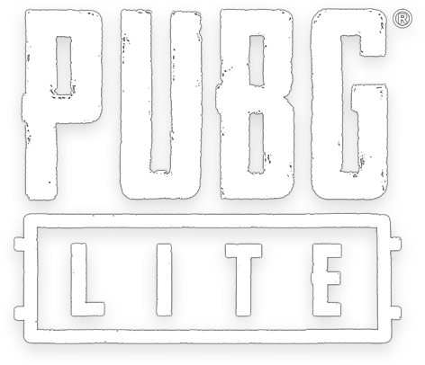
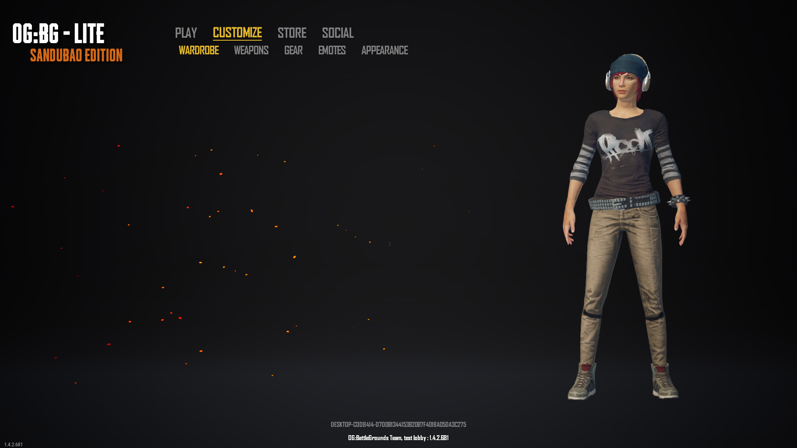

[](https://discord.gg/hmdVw2pR)


v <strike>1.4.2.423 </strike>  
 First I'm going to do 0.7.0.1, as it's "easier"  


### STATUS  
  

### Progress % 

 the game and launcher are still not buildable.  
 I currently work in the game lobby and authentications.  


#    OG:Battlegrounds Lite.
PUBG LITE game reverse engineering, for educational purposes.  

## Game Lobby 

Lobby Code : Branch  [ogbg_lobby](https://github.com/phikill/RE_PUBG_LITE/tree/ogbg_lobby)  
##### WORKS ON ALL VERSIONS OF THE GAME  

```@PUBGLite-Win64-Shipping.exe -UI -LobbyUrl="https://phikill.github.io/RE_PUBG_LITE/custom_lobby/index.html" -AllowJoinAnyMatchState -stdout -LOG -cmd -NOSPLASH -nothreadtimeout```




You can create simple matches in the custom_match menu. To play, simply open two instances of the game: one will be the ```server``` and the other the ```client```.   

By default, the game opens on port ```7777```.   

matchmaking works up to version ```1.4.0.15```, in higher versions like ```1.4.2.423``` and ```1.4.2.681``` the game crashes


## Game Launcher


I'm decompiling the launcher and making it in pure C, with support for Linux and even Windows XP.  


## TOOLS


name of the tools so I don't forget  

.PAK files exploring [PUBG Lite Explorer by Warranty Voider](https://github.com/zeroKilo/PUBGLiteExplorerWV)  
UMODEL 

depends22_x64  
FModel  
JWlink  
SmartSteamEmu143  
uasm256_x86  
umodel_win32  
CheatEngine  
node.js  
UAssetGUI  
UnrealLocres  
Wireshark  
Xenos_2.3.2  
Ghidra  
7zip  
xvolkolak  
ForceToolKit  
SublimeText  
RegShot  
winapiexec64  
QuickUnpack 4.3  
Process Explorer  
Detect It Easy DIE  
OpenHashTab  
EchoMirage  
[FakeNet](https://github.com/fireeye/flare-fakenet-ng/releases)  
Nmap  
HXD  
ImHex  
FileGrab  
Error Lookup  
dnSpyEx64  
ILSpy  
Delphi IDR  
X64DBG  
CyberChef  
XOpcodeCalc  
Hollows_Hunter  
Cain & Abel  
Postman  
  
## Launcher Free ThirdParty Resources.

Launcher [Newtonsoft.json.dll](https://github.com/JamesNK/Newtonsoft.Json/releases/tag/13.0.3 ) v12.01  
Launcher [WpfAnimatedGif.dll](https://github.com/XamlAnimatedGif/WpfAnimatedGif) v1.4.18  
Launcher [System.Web.Http.dll](https://www.nuget.org/packages/microsoft.aspnet.webapi.client/5.2.6) v5.2.61128.0  ASP.NET  
Launcher [System.ValueTuple.dll](https://dotnet.microsoft.com/pt-br/download/dotnet-framework/net462) v4.6.26515.6  NET.FRMW  
Launcher [System.Net.Http.Formatting.dll](https://www.nuget.org/packages/microsoft.aspnet.webapi.client/5.2.6) v5.2.61128.0  ASP.NET  
Launcher [System.Diagnostics.FileVersionInfo.dll](https://dotnet.microsoft.com/pt-br/download/dotnet-framework/net462) v4.6.24705.1 NET-FRMW  
Launcher [Microsoft.IdentityModel.Tokens.dll](https://www.nuget.org/packages/Microsoft.IdentityModel.Tokens/5.4.0) v5.4.0.60123  Microsoft IdentityModel  
Launcher [Microsoft.IdentityModel.Logging.dll](https://www.nuget.org/packages/Microsoft.IdentityModel.Tokens/5.4.0) v5.4.0.60123  Microsoft IdentityModel  
Launcher [libGLESv2.dll](https://github.com/adobe/angle/tree/master/src/libGLESv2) v2.1.0.0  
Launcher [libEGL.dll](https://github.com/adobe/angle/tree/master/src/libEGL) v2.1.00  
Launcher [libcef.dll](https://www.nuget.org/packages/AZ.ChromiumFX) v3.3578.1870.0  I didn't find this version.  
Launcher [d3dcompiler_47.dll](https://strontic.github.io/xcyclopedia/library/d3dcompiler_47.dll-F63597DF3B9348FFC0700915768987D1.html) v10.0.17134.12  
Launcher [chrome_elf.dll](https://chromium.googlesource.com/chromium/src/+/master/chrome/chrome_elf/) v71.0.3578.98 ??  
Launcher [chrome_elf.dll](https://chromereleases.googleblog.com/2018/12/stable-channel-update-for-desktop_12.html) v71.0.3578.98 ??  
Launcher [CefSharp.Wpf.dll](https://www.nuget.org/packages/CefSharp.Common/71.0.2) v71.0.2.0  
Launcher [CefSharp.dll](https://www.nuget.org/packages/CefSharp.Common/71.0.2) v71.0.2.0  
Launcher [CefSharp.Core.dll](https://www.nuget.org/packages/CefSharp.Common/71.0.0) v71.0.0.0  
Launcher [CefSharp.BrowserSubprocess.Core.dll](https://www.nuget.org/packages/CefSharp.Common/71.0.0) v71.0.0.0  
Launcher [CefSharp.BrowserSubprocess.exe](https://www.nuget.org/packages/CefSharp.Common/71.0.2) v71.0.2.0  
Launcher CefSharp Source [Link](https://github.com/cefsharp/CefSharp/releases/tag/v71.0.2) v71.0.2  
Launcher CefSharp Source [Link](https://github.com/cefsharp/CefSharp/releases/tag/v71.0.0) v71.0.0  

### What are these remaining files for? 

#### ``` cef.pak, cef_100_percent.pak, cef_200_percent.pak, cef_extensions.pak ```: These are CEF (Chromium Embedded Framework) resource packs. They contain data such as texts, images, settings, and other resources necessary for the built-in browser to function. The "100_percent" and "200_percent" versions refer to the resolution of the assets (100% and 200% for high DPI devices).  

#### ``` devtools_resources.pak ```: This file contains the resources used by the Chromium Developer Tools, which can be accessed in Chromium-based browsers.  

#### ``` icudtl.dat: ```: This file contains internationalization and language support data, necessary for CEF to support different languages ​​and text encodings (via ICU - International Components for Unicode).  

#### ``` snapshot_blob.bin ```: This file is part of the V8 engine (Chromium's JavaScript engine). It stores a snapshot (an initial "image") of the JavaScript virtual machine's memory state to speed up loading.  

#### ``` v8_context_snapshot.bin ```: This file is used by V8 to initialize JavaScript execution contexts more quickly. It contains a predefined capture of a JavaScript environment that can be loaded directly instead of being generated dynamically.  

#### Many of the files are related to the Chromium Embedded Framework (CEF), which the launcher appears to use to embed a Chromium-based browser within the application. This allows the launcher interface to utilize web technologies and execute scripts, such as JavaScript, in a secure and controlled environment. The .pak and .bin files are part of the support for web rendering, internationalization, and efficient JavaScript execution.  


