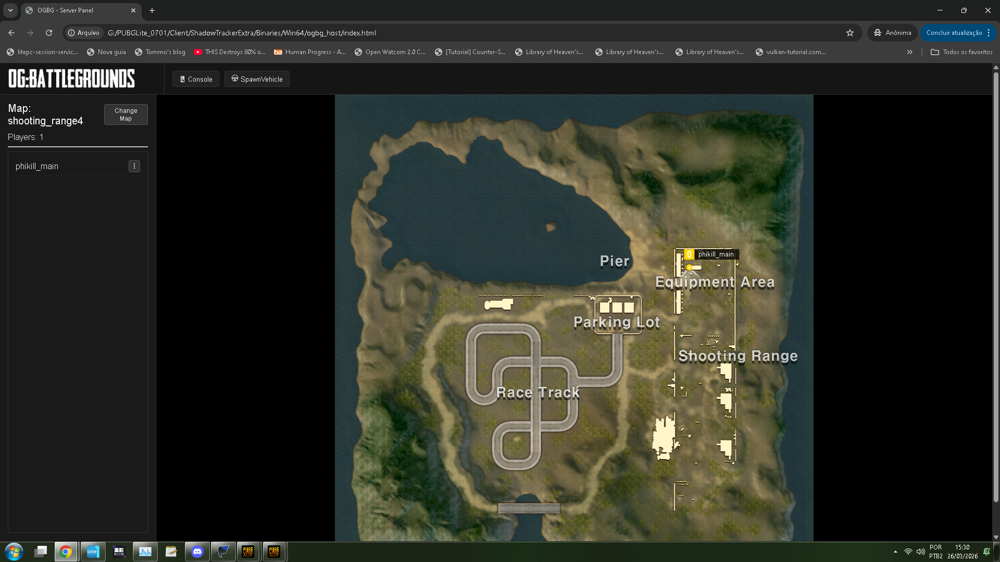
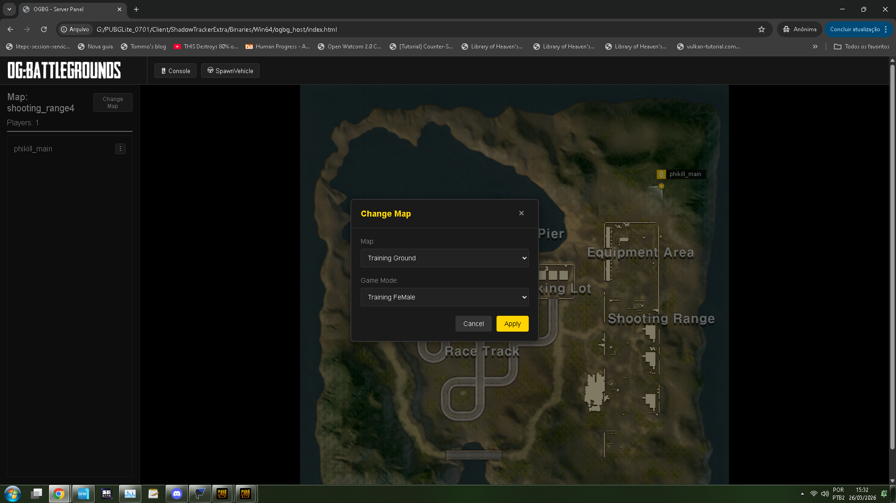
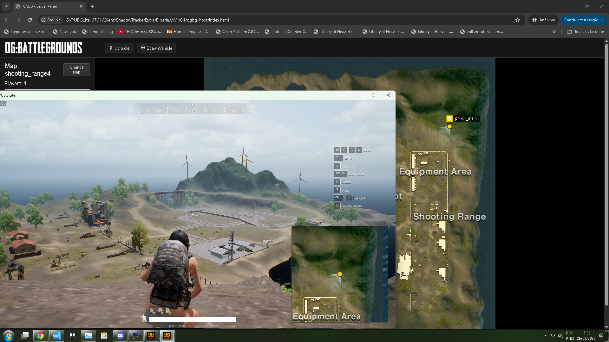
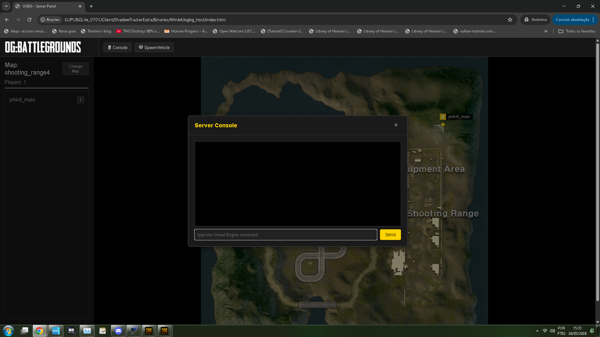
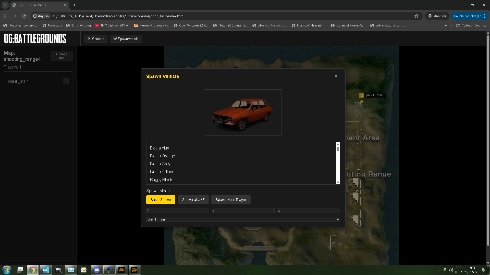
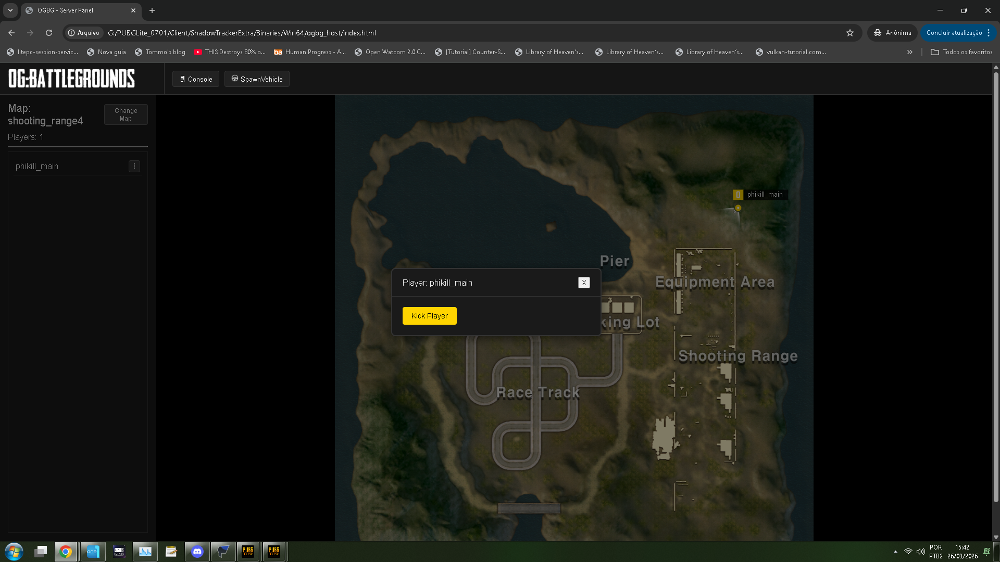

[](https://discord.gg/E5vXyRd4ks)  
You can join our *Discord* server by clicking the button above.  


### STATUS  
  ### 🟢 Active, currently debugging the game's binary using an SDK generator and IDA and Ghidra.

### Progress 0.7% 


#    OG:Battlegrounds Lite.
PUBG LITE game reverse engineering, for educational purposes.  


I want a free roam version of this game, which is why I'm working hard on the project.  
And also to have control over the game, I want to do funny things.  


In short, the game is working but needs several things fixed to make it stable and functional.  


## NOTE! Current issues - that have not yet been repaired

### As a side Note, the issue with items dropping on the ground wasn't fixed until version 0.7.0.1, because other versions are packed.   

#### Vehicles
 - [x] Being able to drive  - Fix by ```PHIKILL```
 - [x] character positioned correctly in the seats  - Fix by ```PHIKILL```
 - [x] correctly switch to the vehicle seats, press CTRL + 1, 2, 3, 4, 5, 6, 7, 8, 9  - Fix by ```PHIKILL```
 - [x] to be able to get out of the vehicle  - Fix by ```PHIKILL```
   - NOTE! For now, the character is quite buggy when exiting the vehicle.
      The bugs are: character rotation and invalid activation of the underwater state.  
  
#### Character 
 - [ ] When aiming with ADS, the animation should be correct.  
 - [x] When looking around, the server replicates the character rotation according to the yaw while it is stationary.
    - NOTE! I made a quick fix, so this conflicts with the **```ALT FreeCam```**, but it helps with the punching gameplay.
 - [x] receive and give damage - *needs to improve*  - Fix By ```H4tiux```
 - [x] successfully landing - *needs to improve* - Fix By ```JerryPrimeDev``` and ```PHIKILL```  
 - [ ] Correctly updating character information in the inventory. such as keeping a helmet and other equipment even when they are unequipped.

#### World
 - [ ] Relevance correction based on distance from the camera's ```viewTarget```. - This problem causes physics-based actors to fall when they are far from the host's camera.  
 - [ ] DOORS, Yes, the doors are quite complicated; they neither open nor close, and they are not being replicated.
    - NOTE! Partially fixed, it works on the host, but the door is not replicated to the clients.
 - [ ] Item spawning on maps  
 - [ ] Vehicle spawning on maps  


#### Weapons
 - [ ] Replicate gunshots, including impact, decals, effects, and damage.  
 - [x] reloading weapons in newer versions - Fix By ```H4tiux```
 - [ ] The Grenades timings has been corrected to 5 seconds instead of 2.5.  

### Other issues in newer versions were fixed by H4tiux, such as the camera in the battle royale plane, getting out of the plane, crash problems, and others.


## Game Lobby 

### Lobby Code : -> [ogbg_lobby](https://github.com/phikill/RE_PUBG_LITE/tree/ogbg_lobby)  
#### *WORKS ON ALL VERSIONS OF THE GAME*  

### The following are parameter commands for the online lobby hosted on GitHub Pages.
### If you want to use it offline, access the branch and follow the instructions.  

```@PUBGLite-Win64-Shipping.exe -UI -LobbyUrl="https://phikill.github.io/RE_PUBG_LITE/custom_lobby/index.html" -AllowJoinAnyMatchState -LOG -NOSPLASH```


You can create simple matches in the custom_match menu. To play, simply open two instances of the game: one will be the ```server``` and the other the ```client```.   

By default, the game opens on port ```7777```.   

matchmaking works up to version ```1.4.0.15```, in higher versions like ```1.4.2.423``` and ```1.4.2.681``` the game crashes


## Game Launcher

##### *WORKS ON ALL VERSIONS OF THE GAME*   

 I'm decompiling the launcher and making it in pure C, with support for ~~Linux~~ and even ~~Windows XP~~.  
### Currently, I only have Windows, and I've disabled XP support for now, as it doesn't make sense.  

### You can download this branch here; it contains the source code and the binary file in ```bin/nt_64/```.   
## Branch Link :[Launcher Source Code](https://github.com/phikill/RE_PUBG_LITE/tree/ogbg_game_launcher)  
 
 Login Page - nickname only  
  

 Login Page - nickname Set *```CHICKEN```*  in capital  
  

 Main Page - there is little here   
  

### The ```LauncherIpc.dll``` implementations work.  

 Nickname inside Game - set in launcher - lobby view 0.7.0.1  
  

 Nickname inside Game - set in launcher - Training Mode 0.7.0.1  
  


## IGNORE, OLD PHOTOS , the first steps of the project , It only works now on ```Windows 7 x64``` or higher .
 Cef Working o Windows XP  


 and the same code working on linux  


## Server Panel

I created this Server Panel to remotely control the server from a browser, view its status, and more.  

More implementations and bug fixes will follow in the future.  

  

#### You can switch maps and gamemode blueprints.   
  

#### The players' positions will be represented on the 2D map.   

  

#### You can call Unreal console commands from the page; there are some tick issues at the moment, but I'll fix that later.   
  


#### You can spawn vehicles from the page; there are some tick issues at the moment, but I'll fix that later.
  


#### You can kick any players you want out of the match.
 


# ⬇️ Download Section <- Game Backups  

or this  
  🟢[1.4.2.681 | (02.22.2021) link 1](https://drive.google.com/drive/folders/19vs1__70kZsb7YQScpdWKtGa2-Xwi9gj)  
  🟢[1.4.2.681 | (02.22.2021) link 2](https://archive.org/details/pubglitebuild)  
  🟢[1.4.2.423 | (23.02.2020)](https://drive.google.com/drive/folders/1IWccZ7mIpKqnnrxmyTDGBmvkkb2tyOqD)  
  🟢[1.4.2.14  | (..)](https://archive.org/details/pubglite-client-garena)  
  🟢[1.4.0.15  | (21.11.2019)](https://drive.google.com/file/d/1vQizbEEg1mBOqHECOLK_x265lKeJYsWr/view)  
  🟢[1.3.0.90  | (10.10.2019)](https://drive.google.com/drive/folders/1ZVqzeA_iAaDMlKcgl4jdZ7Vxj8J78qS4)  
  🔴[1.0.0.40  | (2019)](https://windows96.net/)  
  🟢[0.8.3.14  | (6.07.2019) link 1](https://drive.google.com/file/d/1wotozQEiRqluQlcPX__wfgg1dLGDOkCj)  
  🟢[0.8.3.14  | (6.07.2019) link 2](https://drive.google.com/file/d/1Pgsy5zvh6LkAXkD9flAm4XzQ8z94fwlw)  
  🟢[0.8.1.29  | (1.8.2019) link 1](https://www.mediafire.com/folder/ae379oal06b31/PUBG_Lite_Pc)  
  🟢[0.8.1.29  | (1.8.2019) link 2](https://drive.google.com/file/d/1iSWF9-58YD8qAft4wjSaMgEw1742tYZn)  
  🟢[0.7.7.20  | (2019)](https://drive.google.com/drive/folders/1IksQao0KPgU1KEnwEug7qDpdiBBIAxxt)  
  🔴[0.7.3.32  | (2019)](https://cat-bounce.com/)   
  🔴[0.7.1.48  | (2.2019)](https://hackertyper.net/)  
  🟢[0.7.0.1   | (24.1.2019) link 1](https://gamingredzzone.blogspot.com/2018/03/download-pubg-pc-lite-highly-compressed.html)  
  🟢[0.7.0.1   | (24.1.2019) link 2](https://drive.google.com/file/d/1KYxERzT6huJszMLa5hljvZ1KoR5L3tbG)  

## TOOLS

some tools that I use to modify the game

name of the tools so I don't forget  


 ### *navigate through the game's resources.*  

.PAK files exploring [PUBG Lite Explorer by Warranty Voider](https://github.com/zeroKilo/PUBGLiteExplorerWV)  
[UMODEL](https://www.gildor.org/en/projects/umodel)   
[FModel](https://fmodel.app/)   
[UAssetGUI](https://github.com/atenfyr/UAssetGUI)  
[UnrealLocres](https://github.com/Snoozeds/UnrealLocresEditor)  


### *Network manipulation and Backend*

[Wireshark](https://www.wireshark.org/) 
[EchoMirage](https://sourceforge.net/projects/echomirage.oldbutgold.p/)  
[FakeNet](https://github.com/fireeye/flare-fakenet-ng/releases)  
[Cain & Abel](https://sectools.org/tool/cain/)   
[Postman](https://www.postman.com/)   
[node.js](https://nodejs.org/)   
[Nmap](https://nmap.org/)   


### *Direct Modification to the binary*

QuickUnpack 4.3  
[xvolkolak Unpacker](https://n10info.blogspot.com/2018/03/xvolkolak-010.html)    
[Detect It Easy DIE](https://github.com/horsicq/Detect-It-Easy)    
[HXD](https://mh-nexus.de/en/hxd/)    
[ImHex](https://imhex.werwolv.net/)    

##### Launcher Binaries and C# things
[dnSpy](https://dnspy.org/)    
[ILSpy](https://ilspy.org/)    

### *Manipulating values ​​in memory*

[CheatEngine](https://www.cheatengine.org/)  

### *Unreal Engine Dumpers, and others*  

[Dumper-7](https://github.com/Encryqed/Dumper-7)   
[UE4-Function-Address-Finder](https://github.com/patrickBakin/UE4-Function-Address-Finder)   
[Unreal Engine Uasset Viewer/Editor](https://github.com/kaiheilos/Utilities)  
[Kismet Analyzer](https://github.com/trumank/kismet-analyzer)  

### *Analyze system calls and usage of the Win32 API, among other things.*

[depends22_x64](https://www.dependencywalker.com/)    
[winapiexec64](https://ramensoftware.com/winapiexec)    
[Xenos_2.3.2](https://github.com/DarthTon/Xenos/releases)    
[X64DBG](https://x64dbg.com/)  
[Ghidra](https://github.com/NationalSecurityAgency/ghidra)     
[Error Lookup](https://github.com/henrypp/errorlookup)    
[FileGrab](https://sourceforge.net/projects/filegrab/)    
[ForceToolKit](https://autoclose.net/forcetoolkit.html)    
[RegShot](https://sourceforge.net/projects/regshot/)     
[Process Explorer](https://www.majorgeeks.com/files/details/microsoft_process_explorer.html)   
[OpenHashTab](https://github.com/namazso/OpenHashTab)    

[JWlink](https://github.com/JWasm/JWlink)    
[UASM](https://github.com/Terraspace/UASM)   

  

### *other utilities*
  
[CyberChef](https://gchq.github.io/CyberChef/)    
[XOpcodeCalc](https://github.com/horsicq/XOpcodeCalc)  
[Hollows_Hunter](https://github.com/hasherezade/hollows_hunter)  
 
   
  


  

 
  
  
  


