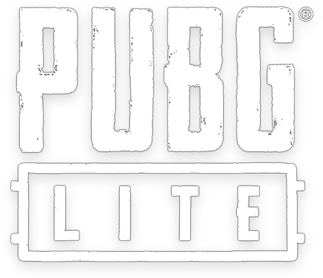
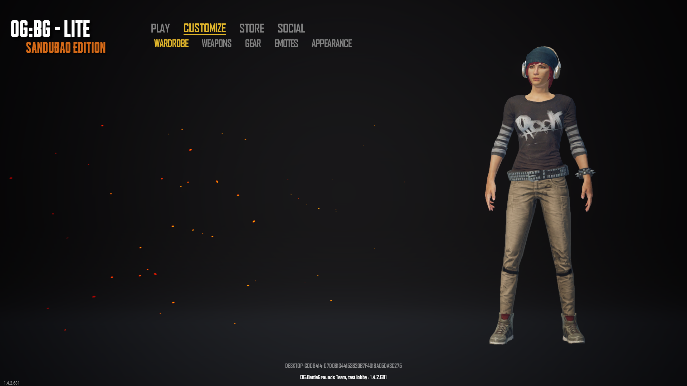
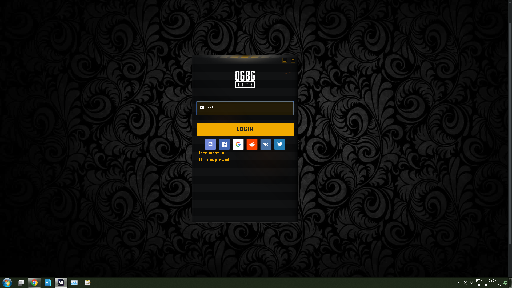
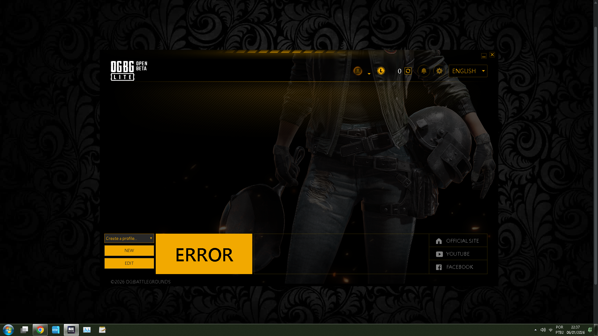
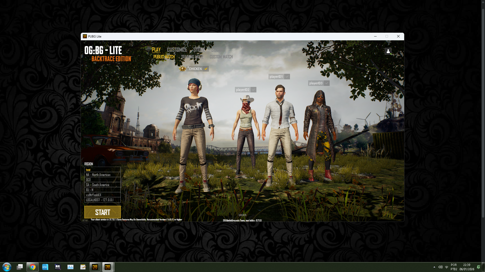
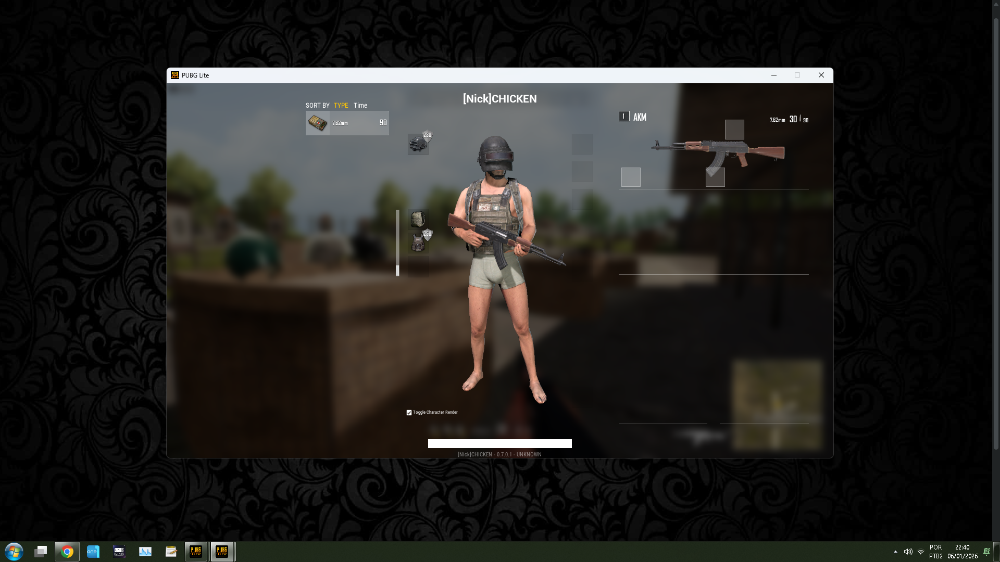
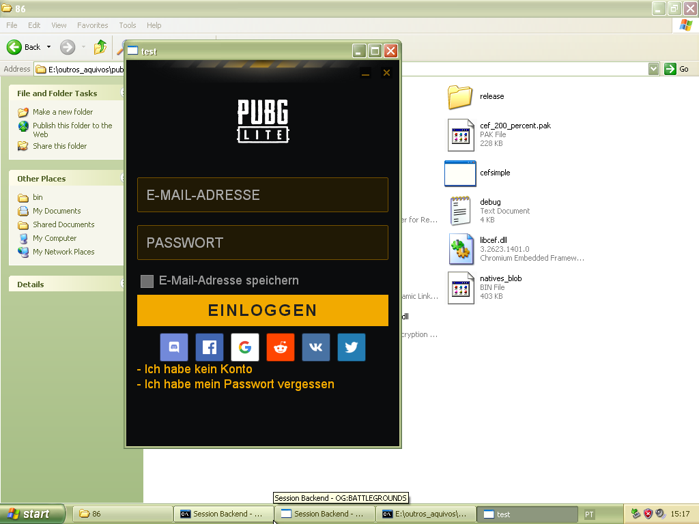
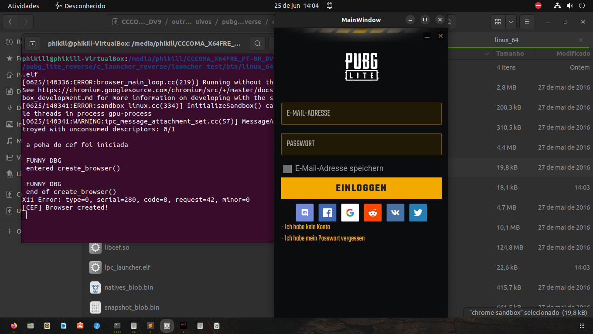

[](https://discord.gg/E5vXyRd4ks)  
You can join our *Discord* server by clicking the button above.  


### STATUS  
  ### 🟢 Active, currently debugging the game's binary using an SDK generator and IDA and Ghidra.

### Progress 0.7% 


#    OG:Battlegrounds Lite.
PUBG LITE game reverse engineering, for educational purposes.  


I want a free roam version of this game, which is why I'm working hard on the project.  
And also to have control over the game, I want to do funny things.  


In short, the game is working but needs several things fixed to make it stable and functional.  


## Game Lobby 

### Lobby Code : -> [ogbg_lobby](https://github.com/phikill/RE_PUBG_LITE/tree/ogbg_lobby)  
#### *WORKS ON ALL VERSIONS OF THE GAME*  

### The following are parameter commands for the online lobby hosted on GitHub Pages.
### If you want to use it offline, access the branch and follow the instructions.  

```@PUBGLite-Win64-Shipping.exe -UI -LobbyUrl="https://phikill.github.io/RE_PUBG_LITE/custom_lobby/index.html" -AllowJoinAnyMatchState -LOG -NOSPLASH```




You can create simple matches in the custom_match menu. To play, simply open two instances of the game: one will be the ```server``` and the other the ```client```.   

By default, the game opens on port ```7777```.   

matchmaking works up to version ```1.4.0.15```, in higher versions like ```1.4.2.423``` and ```1.4.2.681``` the game crashes


## Game Launcher

##### *WORKS ON ALL VERSIONS OF THE GAME*   

 I'm decompiling the launcher and making it in pure C, with support for ~~Linux~~ and even ~~Windows XP~~.  
### Currently, I only have Windows, and I've disabled XP support for now, as it doesn't make sense.  

### You can download this branch here; it contains the source code and the binary file in ```bin/nt_64/```.   
## Branch Link :[Launcher Source Code](https://github.com/phikill/RE_PUBG_LITE/tree/ogbg_game_launcher)  
 
 Login Page - nickname only  
  

 Login Page - nickname Set *```CHICKEN```*  in capital  
  

 Main Page - there is little here   
  

### The ```LauncherIpc.dll``` implementations work.  

 Nickname inside Game - set in launcher - lobby view 0.7.0.1  
  

 Nickname inside Game - set in launcher - Training Mode 0.7.0.1  
  


## IGNORE, OLD PHOTOS , the first steps of the project , It only works now on ```Windows 7 x64``` or higher .
 Cef Working o Windows XP  


 and the same code working on linux  


# ⬇️ Download Section <- Game Backups  

or this  
  🟢[1.4.2.681 | (02.22.2021) link 1](https://drive.google.com/drive/folders/19vs1__70kZsb7YQScpdWKtGa2-Xwi9gj)  
  🟢[1.4.2.681 | (02.22.2021) link 2](https://archive.org/details/pubglitebuild)  
  🟢[1.4.2.423 | (23.02.2020)](https://drive.google.com/drive/folders/1IWccZ7mIpKqnnrxmyTDGBmvkkb2tyOqD)  
  🟢[1.4.2.14  | (..)](https://archive.org/details/pubglite-client-garena)  
  🟢[1.4.0.15  | (21.11.2019)](https://drive.google.com/file/d/1vQizbEEg1mBOqHECOLK_x265lKeJYsWr/view)  
  🟢[1.3.0.90  | (10.10.2019)](https://drive.google.com/drive/folders/1ZVqzeA_iAaDMlKcgl4jdZ7Vxj8J78qS4)  
  🔴[1.0.0.40  | (2019)](https://windows96.net/)  
  🟢[0.8.3.14  | (6.07.2019) link 1](https://drive.google.com/file/d/1wotozQEiRqluQlcPX__wfgg1dLGDOkCj)  
  🟢[0.8.3.14  | (6.07.2019) link 2](https://drive.google.com/file/d/1Pgsy5zvh6LkAXkD9flAm4XzQ8z94fwlw)  
  🟢[0.8.1.29  | (1.8.2019) link 1](https://www.mediafire.com/folder/ae379oal06b31/PUBG_Lite_Pc)  
  🟢[0.8.1.29  | (1.8.2019) link 2](https://drive.google.com/file/d/1iSWF9-58YD8qAft4wjSaMgEw1742tYZn)  
  🟢[0.7.7.20  | (2019)](https://drive.google.com/drive/folders/1IksQao0KPgU1KEnwEug7qDpdiBBIAxxt)  
  🔴[0.7.3.32  | (2019)](https://cat-bounce.com/)   
  🔴[0.7.1.48  | (2.2019)](https://hackertyper.net/)  
  🟢[0.7.0.1   | (24.1.2019) link 1](https://gamingredzzone.blogspot.com/2018/03/download-pubg-pc-lite-highly-compressed.html)  
  🟢[0.7.0.1   | (24.1.2019) link 2](https://drive.google.com/file/d/1KYxERzT6huJszMLa5hljvZ1KoR5L3tbG)  

## TOOLS

some tools that I use to modify the game

name of the tools so I don't forget  

.PAK files exploring [PUBG Lite Explorer by Warranty Voider](https://github.com/zeroKilo/PUBGLiteExplorerWV)  
UMODEL 

depends22_x64  
FModel  
JWlink  
SmartSteamEmu143  
uasm256_x86  
umodel_win32  
CheatEngine  
node.js  
UAssetGUI  
UnrealLocres  
Wireshark  
Xenos_2.3.2  
Ghidra  
7zip  
xvolkolak  
ForceToolKit  
SublimeText  
RegShot  
winapiexec64  
QuickUnpack 4.3  
Process Explorer  
Detect It Easy DIE  
OpenHashTab  
EchoMirage  
[FakeNet](https://github.com/fireeye/flare-fakenet-ng/releases)  
Nmap  
HXD  
ImHex  
FileGrab  
Error Lookup  
dnSpyEx64  
ILSpy  
Delphi IDR  
X64DBG  
CyberChef  
XOpcodeCalc  
Hollows_Hunter  
Cain & Abel  
Postman  
  


